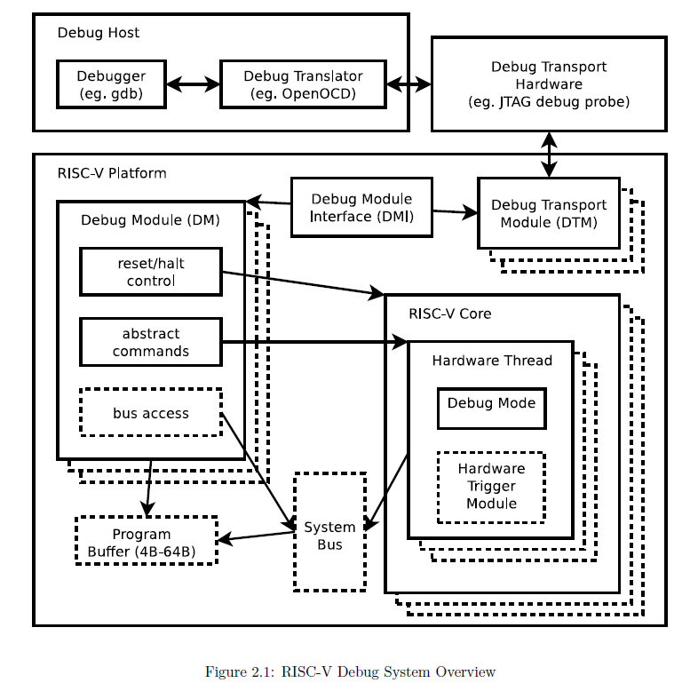
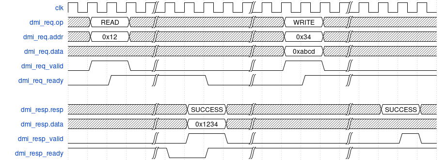
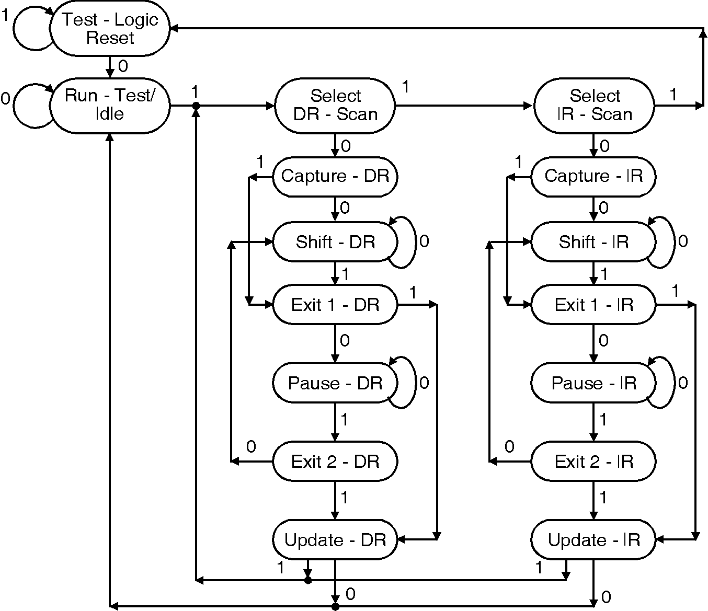

# RISCV debug module for Aquila Core
## Abstract
Due to the increasing complexity in modern microprocessor, the Debug Module(DM) become much more important nowadays to help user to understand and change the state of processor, so users can find out where is the bug more easily. For processor designer, DM can also help them to check the functionality of processor is correct or not. 

This study implement a DM partially compatible with [riscv-debug-release 0.13.2](https://riscv.org/wp-content/uploads/2019/03/riscv-debug-release.pdf), and also add some hardware extension in Aquila core to work with DM.
### Features
- Functionality
	- halt, resume, step, reset on a hart
	- memomy access 
	- registers(GPRs/CSRs) access
	- hardware breakpoint
- HW requirement 
    - can be synthesized on Xilinx arty-a7100t
    - connected to host PC via USB with the help of Xilinx BSCANE2 primitive, no extra jtag cable is required
- SW requirement
    - use [openocd-riscv](https://github.com/riscv-collab/riscv-openocd) to connect debug module and host PC
    - build [riscv-toolchain](https://github.com/riscv-collab/riscv-gnu-toolchain/tree/master) and debug with gdb

### Compability to RISCV-debug specification
**Feature**                            | **Support**
-------------------------------------- | --------------------------------------------------------------------------------------
Hardware trigger        | Support up to 32 breakpoints, while watchpoint are not implemented currently.
System Bus Access (SBA)  | Not supported at this time.
User Authentication | Not supported at this time.
Program buffer for hart to run any instruction | Supported.
Multiple hart support | Not supported at this time.
Abstract Command | Support to access GPR.

## System overview

*From chap 2 of RISCV-debug spec*

## Component

### Debug Module Control and Status registers (dm_csrs)

There are several register in the debug module, host can write to these registers to control the debug system and read from these registers to get the information about the core or retrieve returned data of previous command.

- **Debug Module Control** (dmcontrol, 0x10):   Host will write to this register to control the state of current selected core

Expand all

    
    **Field** | **Access** | **Usage**
    ----------|------------|----------
    haltreq | W | Write to this field to halt the core
    resumereq | W | Write to this field to resume a halted core
    ndmreset | W/R | Write to this field to reset the system except for the debug module
    dmactive | W/R | Write 1 to this field to indicate the debug module is activated

- **Debug Module Status** (dmstatus, 0x11): This register contains the core's information, host can read it to check if the debug system work correctly

Expand all

    **Field** | **Access** | **Usage** 
    ----------|------------|-----------
    all/anyhavereset | R | Read from this field to check if the core reset correctly
    all/anyresumeack | R | Read from this field to check if the last resume request have been acked by the debug module
    all/anyrunning | R | Read from this field to check if the core are running(not in debug mode)
    all/anyhalted | R | Read from this field to check if the core are in debug mode

- **Abstract Command Control and Status** (abstractcs, 0x16): Host can read this register to get the information about Abstract Command or Program Buffer

Expand all

    **Field** | **Access** | **Usage** 
    ----------|------------|-----------
    progbufsize | R | The size of program buffef, which is 8 in our implementation
    busy | R | This bit will be set when the anstract command is running on the core
    cmderr | R/W1C | 0 (None): no error 1 (busy): debug module is executing abstract command 2 (not support): the given abstract command is not supported 4 (halt/resume): the command can't be executed due to the incorrect state of the core
    datacount | R | The size of data register, which is 2 in our implementation

- **Abstract Command** (command, 0x17): Write to this register will make the hardware to generate corresponding instruction for performing certain operation, which will save time from writing to program buffer

Expand all

    **Field** | **Access** | **Usage**
    ----------|------------|-----------
    cmdtype | W | 1. Access Register: Read/Write to CSR or GPR 2.Quick Access: Not implemented
    control | W | Specify the operation on choosen register

- **Program Buffer** (progbuf0-progbuf15, 0x20-0x2f): Since our implementation does not support using abstracts command to read/write memory, program buffer is needed to provide assistance for memory operation

Expand all

    **Field** | **Access** | **Usage**
    ----------|------------|-----------
    data | W | Write instructions to these registers to make the core to run any instructions

### Debug Memory (dm_mem)

This is a 16kB memory interface of Debug Module, the functionality of this module are listed below:
- **Debug Rom** (For execution-based deubg): In reality, halting a core by stopping the clock is difficult to implement, so it is not a good idea to do that in our design. Instead, when a halt request is comming, the PC will be set to the predefined *halt address*, which contains a loop consists of a set of instructions. 
> The content of Debug Rom are reference from [Rocket-Chip's debug rom](https://github.com/chipsalliance/rocket-chip/blob/master/scripts/debug_rom/debug_rom_nonzero.S)
- **Debug Ram**:
    - Program Buffer: User can write arbitrary instruction into Program Buffer to force the core to do anything.
    - Abstract Command: In order to access registers, the debug module will generate series of instruction to get the register's value and write them into Data registers.
- **Memory mapping**:

Expand all

    **Address** | **Description** 
    ------------|-----------------
    0x000-0x0ff | unused
    0x100 | **Halted**, core will write to this address to comfirm it is halted
    0x108 | **Going**, core will write to this address to comfirm it is executing some command
    0x110 | **Resuming**, core will write to this address to comfirm it is resuming
    0x330 | **whereto**, core will jump to this address whenever the abstract command or program buffer are set correctly, and the instruction at this address will decide where to jump to(Abstract Command or Program Buffer)
    0x338-0x35f | **Abstract Command**
    0x360-0x37f | **Program Buffer**
    0x380-0x388 | **Data**, host can read returned data from this address
    0x800-0x1000 | **Debug Rom**, as described as above
    0x800 | **Halt Address**, core will jump to here when it is requested to halt
    0x808 | **Resume Address**, core will jumpt to here when it is requedted to resume

### Debug Module Jtag Interface (dmi_jtag)
With regard to construct communication between host PC and debug module, we choose JTAG as our communication protocal. The main purpose of this module is receiving JTAG signal from host PC to generate debug request(dmi_req), and receiving dmi_resp from debug module and translating it into JTAG signal for transmission.

- **Debug request and Debug response**:
    - Debug request: 
        **address** | **op** | **data** 
        ------------|--------|---------
        Target address | specify the operation is Read/Write | Read: Have no usage  Write: Specify the value to write to target address
    - Debug response: 
        **data** | **resp** 
        ---------|---------
        Write: Have no usage Read: Returned data for previous request | **DTM_SUCCESS**: The request is correctly served and data is returned **DTM_ERR**: There is some error during previous request **DTM_BUSY**: DTM(Debug transport module) is busy, host should slow down the rate of sending request
    - Hadshaking protocal:
        For the correctness of the communication, two-way handshake is adopted in our design.
    

Expand the example

     
    this fiqure is download from <a href = https://github.com/pulp-platform/riscv-dbg/tree/master/doc>pulp-debug-system</a>
    

- **Debug Transport Module**:
    - JTAG-Protocol [(IEEE standard for JTAG)](https://ieeexplore.ieee.org/stamp/stamp.jsp?tp=&arnumber=6515989): 
      Since Xilinx FPGA adopt USB-JTAG as a bridge for sending bitstream and gathering waveform captured by ILA(Integrated Logic Anylyzer), choosing USB-JTAG can prevent our design from adding extra cable.
      
    - JTAG-TAP(JTAG-Test Access Port): 
      Xilinx provide [BSCANE2](https://docs.amd.com/r/2021.1-English/ug953-vivado-7series-libraries/BSCANE2) primitive for user to access USB-JTAG directly, they will form a daisy-chain if there are more than one BSCANE2 are instantiated. We use two BSCANE2 primative to avoid the higher complexity of using tunnel mode as discussed in [this issue](https://github.com/openhwgroup/core-v-mcu/issues/117#issuecomment-826280883).
    - Debug Transport Module CSR(dtmcs): 
      A register contain the current state information about DTM 
    
## Change in Aquila Core
For the Aquila Core to be compatible with our Debug Module implementation, some minimized and essential changes should be apply to the original aquila core.
- CSR_file: 
[RISC-V debug spec](chrome-extension://efaidnbmnnnibpcajpcglclefindmkaj/https://riscv.org/wp-content/uploads/2019/03/riscv-debug-release.pdf) defines several CSRs for supporting debug and they are listed below.
- Core Debug Registers 
    **Address** | **Name** | **Usage** 
    ------------|----------|-----------

