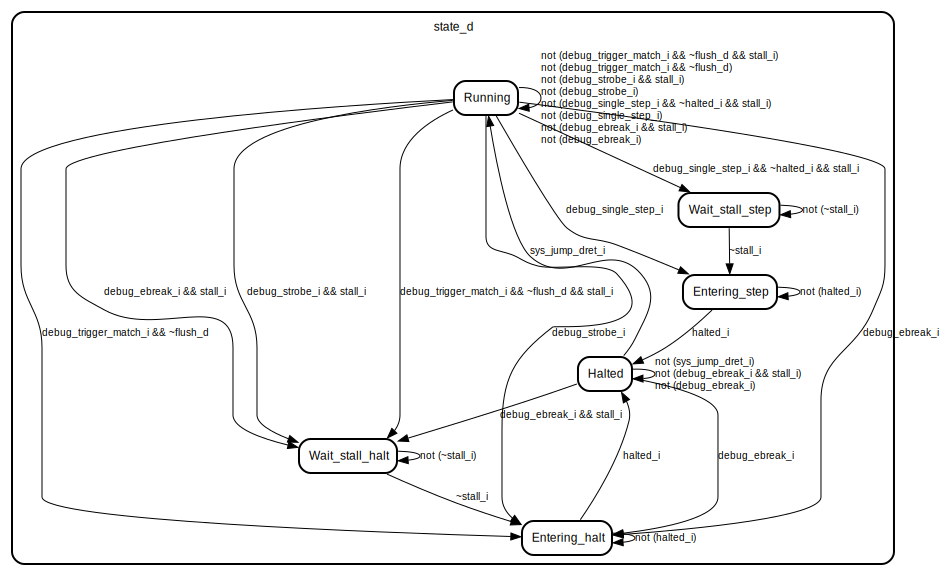

# Debug Support for Aquila core
## Abstract
Due to the increasing complexity of modern microprocessors, the Debug Module(DM) become much more important nowadays to help users understand and change the state of processors, so users can find out where is the bug more easily. For processor designers, DM can also help them check whether the functionality of processors is correct or not. 

This study implements a DM partially compatible with [RISCV-debug-release 0.13.2](https://riscv.org/wp-content/uploads/2019/03/riscv-debug-release.pdf), and also adds some hardware extension in Aquila core to work with DM.
### Features
- Functionality
    - halt, resume, step, reset on a hart
    - memory access 
    - registers(GPRs/CSRs) access
    - hardware breakpoint
- HW requirement 
    - can be synthesized on Xilinx arty-a7100t
    - connected to host PC via USB with the help of [Xilinx BSCANE2 primitive](https://docs.amd.com/r/2021.1-English/ug953-vivado-7series-libraries/BSCANE2), no extra JTAG cable is required
- SW requirement
    - use [openOCD-riscv](https://github.com/riscv-collab/riscv-openocd) to connect debug module and host PC
    - build [riscv-toolchain](https://github.com/riscv-collab/riscv-gnu-toolchain/tree/master) and debug with gdb

### Compatibility to RISCV-debug specification
**Feature** | **Support**
------------------------------------- | --------------------------------------
Hardware trigger        | Support up to 32 breakpoints, while watchpoint are not implemented currently.
System Bus Access (SBA)  | Not supported at this time.
Program buffer for the core to run any instruction | Supported.
Multiple cores support | Not supported at this time.
Abstract Command | Support to access GPR. other type can be done by program buffer

## System Overview

<br>
*From chapter 2 of RISCV-debug spec*

## Component

### Debug Module Control and Status registers (dm_csrs)

There are several registers in the debug module, the host can write to these registers to control the debug system and read from these registers to get information about the core or retrieve returned data of the previous command.

- **Debug Module Control** (dmcontrol, 0x10): <br> Host will write to this register to control the state of current selected core<details open="true"><summary>Expand all</summary>

     **Field** | **Access** | **Usage**
    ----------|------------|----------
    haltreq | W | Write to this field to halt the core
    resumereq | W | Write to this field to resume a halted core
    ndmreset | W/R | Write to this field to reset the system except for the debug module
    dmactive | W/R | Write 1 to this field to indicate the debug module is activated
    </details>

- **Debug Module Status** (dmstatus, 0x11):<br>This register contains the core's information, host can read it to check if the debug system works correctly<details open="true"><summary>Expand all</summary>

        **Field** | **Access** | **Usage** 
    ----------|------------|-----------
    all/anyhavereset | R | Read from this field to check if the core reset correctly
    all/anyresumeack | R | Read from this field to check if the last resume request has been acked by the debug module
    all/anyrunning | R | Read from this field to check if the core are running(not in debug mode)
    all/anyhalted | R | Read from this field to check if the core are in debug mode
    </details>

- **Abstract Command Control and Status** (abstractcs, 0x16):<br>Host can read this register to get the information about Abstract Command or Program Buffer<details open="true"><summary>Expand all</summary>

        **Field** | **Access** | **Usage** 
    ----------|------------|-----------
    progbufsize | R | The size of the program buffer, which is 8 in our implementation
    busy | R | This bit will be set when the abstract command is running on the core
    cmderr | R/W1C | 0 (None): no error<br>1 (busy): debug module is executing abstract command<br>2 (not support): the given abstract command is not supported<br>4 (halt/resume): the command can't be executed due to the incorrect state of the core
    datacount | R | The size of the data register, which is 2 in our implementation
</details>

- **Abstract Command** (command, 0x17):<br>Write to this register will make the hardware generate corresponding instructions for performing the certain operation, which will save time from writing to program buffer<details open="true"><summary>Expand all</summary>

        **Field** | **Access** | **Usage**
    ----------|------------|-----------
    cmdtype | W | 1. Access Register: Read/Write to CSR or GPR<br>2.Quick Access: Not implemented
    control | W | Specify the operation on the target register
</details>

- **Program Buffer** (progbuf0-progbuf15, 0x20-0x2f):<br>Since our implementation does not support using abstracts command to read/write memory, program buffer is needed to assist in memory operation<details open="true"><summary>Expand all</summary>

     **Field** | **Access** | **Usage**
    ----------|------------|-----------
    data | W | Write instructions to these registers to make the core run any instructions
</details>

### Debug Memory (dm_mem)

This is a 16kB memory interface of the Debug Module, some functionalities of this module are listed below:
- **Debug Rom** (For execution-based debug):<br>In reality, halting a core by stopping the clock is difficult to implement, so it is not a good idea to do that in our design. Instead, when a halt request is coming, the PC will be set to the predefined *halt address*, which contains a loop consisting of a set of instructions. 
> The content of Debug Rom are reference from [Rocket-Chip's debug rom](https://github.com/chipsalliance/rocket-chip/blob/master/scripts/debug_rom/debug_rom_nonzero.S)
- **Debug Ram**:
    - Program Buffer:<br>User can write arbitrary instructions into Program Buffer to force the core to do anything.
    - Abstract Command:<br> To access registers, the debug module will generate a series of instructions to get the register's value and write them into Data registers.
    - Data:<br>User can store Data in these blocks and load Data to the core, and the core can also return requested data by saving them to these blocks.
- **Memory mapping**:<details open="true"><summary>Expand all</summary>
    **Address** | **Description** 
    ------------|---------------
    0x000-0x0ff | unused
    0x100 | **Halted**, the core will write to this address to confirm it is halted
    0x108 | **Going**, the core will write to this address to confirm it is executing some command
    0x110 | **Resuming**, the core will write to this address to confirm it is resuming
    0x330 | **whereto**, the core will jump to this address whenever the abstract command or program buffer is set correctly, and the instruction at this address will decide where to jump to(Abstract Command or Program Buffer)
    0x338-0x35f | **Abstract Command**
    0x360-0x37f | **Program Buffer**
    0x380-0x387 | **Data**, the host can read returned data from this address
    0x800-0x1000 | **Debug Rom**, as described as above
    0x800 | **Halt Address**, the core will jump to here when it is requested to halt
    0x808 | **Resume Address**, the core will jump to here when it is requested to resume

</details>

- State transition diagram for debug memory:<br>

### Debug Module Jtag Interface (dmi_jtag)
About constructing communication between the host PC and the Debug Module, we choose JTAG as our communication protocol. The main purpose of this module is to receive JTAG signal from the host PC to generate a debug request(dmi_req), and receive dmi_resp from the Debug Module and translate it into JTAG signal for transmission.

- **Debug request and Debug response**:
    - Debug request:<br>

        **address** | **op** | **data** 
        ------------|--------|---------
        Target address | specify the operation is Read/Write | Read: Have no usage<br> Write: Specify the value to write to the target address
    - Debug response:<br>

        **data** | **resp** 
        ---------|---------
        Write: Have no usage<br>Read: Returned data for previous request | **DTM_SUCCESS**: The request is correctly served and data is returned<br>**DTM_ERR**: There is some error during previous request<br>**DTM_BUSY**: DTM(Debug transport module) is busy, the host should slow down the rate of sending a request

    - Handshaking protocol:<br>
        For the correctness of the communication, the two-way handshake is adopted in our design.
    <details open="true"><summary>Expand the example</summary>
    <br>
 this figure is download from <a href = https://github.com/pulp-platform/riscv-dbg/tree/master/doc>pulp-debug-system</a>
    </details>

- **Debug Transport Module**:<br>
    - JTAG-Protocol [(IEEE standard for JTAG)](https://ieeexplore.ieee.org/stamp/stamp.jsp?tp=&arnumber=6515989):<br>
    Since Xilinx FPGA adopts USB-JTAG as a bridge for sending bitstream and gathering waveform captured by ILA(Integrated Logic Analyzer), choosing USB-JTAG can prevent our design from adding extra cable.
    

    - JTAG-TAP(JTAG-Test Access Port):<br>
    Xilinx provides [BSCANE2](https://docs.amd.com/r/2021.1-English/ug953-vivado-7series-libraries/BSCANE2) primitive for users to access USB-JTAG directly, they will form a daisy-chain if there are more than one BSCANE2 are instantiated. We use two BSCANE2 primitives to avoid the higher complexity of using tunnel mode as discussed in [this issue](https://github.com/openhwgroup/core-v-mcu/issues/117#issuecomment-826280883)
    

    - Debug Transport Module CSR(dtmcs):<br>
 A register contains the current state information about DTM 
- **Clock-Domain-Crossing module**:<br>
 The Aquila core and Debug Module work in the same clock domain, but the host may construct JTAG connection with a clock rate that is different from the core's, so a CDC module is necessary for the host and core to prevent the occurrence of errors.

    > The CDC module is downloaded from the [PULP's project](https://github.com/pulp-platform/riscv-dbg/blob/master/src/dmi_cdc.sv), not designed by myself.

## Changes in Aquila Core
For the Aquila Core to be compatible with our Debug Module implementation, some minimized and essential changes should be applied to the original Aquila core.
- CSR_file:<br>
[RISC-V debug spec](chrome-extension://efaidnbmnnnibpcajpcglclefindmkaj/https://riscv.org/wp-content/uploads/2019/03/riscv-debug-release.pdf) defines several CSRs for supporting debug and they are listed below.
 - Core Debug Registers:<br>

    The following registers help the debug system work correctly.
    
     **Address** | **Name** | **Usage** 
    ------------|----------|-----------
    0x7B0 | dcsr | Stores the configuration of debug setting and status
    0x7B1 | dpc | Save the next PC before trapped into debug mode for resuming to the correct address
    0x7B2 | dscratch0 | For debug module to store arbitrary information
    0x7B3 | dscratch1 | For debug module to store arbitrary information
 - Trigger Module:<br>
 The following registers are extensions that support adding **hardware-assist breakpoint**

     **Address** | **Name** | **Usage**
    ------------|----------|----------
    0x7a0 | tselect | **Trigger Select**, write the trigger number to this register to select which trigger to operate on
    0x7a1 | tdata1 | **Trigger data 1**, the higher 4 bits specify the type of trigger selected by tselect, which is hardwired to 2, indicating that the trigger is match control.
    0x7a1 | mcontrol | **Match Control**, this is the lower bits of the register, specify the function of the selected trigger. Ex: trap into debug mode before/after instruction execution, the trigger is activated in User/Machine/Debug mode, match condition is ==/>=/<=, etc.
    0x7a12 | tdata2 | **Match Value**, this register stores the breakpoint address of the selected trigger, and when the PC in the fetch stage matches the value in this register, the trigger_match signal will be set, so the core can halt when that instruction is executed.
- Decode stage:<br>
 Add some logic to support decoding of risc-v instructions and integrate dret into system jump.

     **Instruction** | **Description**
    ----------------|----------------
    ebreak | User mode: Trap into debug mode. <br> Machine mode: Do nothing. <br> Debug mode: Jump to Haltaddress.
    dret | User mode: Do nothing.<br>Machine mode: Do nothing.<br>Debug mode: Jump to dpc.
- Program Counter:<br>
 Set PC to haltaddress when the following events occur

    - External debug request
    - Execution of ebreak instruction
    - Trigger match
- Debug Controller:<br>
 The main module controls the debug state of the Aquila core.
    - State transition of debug system:
    

    - Determine the cause of debug by priority
        1. Breakpoint match.
        2. External debug request.
        3. Stepping.
- Core Top:<br>
    - Determine the value of dpc to store from the cause of debug
    - Connect signals of debug_controller to other modules

## How debugger(openOCD) interact with debug module
- **Halt the core**:<br>
    1. dmi_req = {8'h10, 2'h2, 32'h80000001}; // write to dmcontrol and set haltreq to 1
    2. dm_csr send debug_request to core
    3. core set PC to haltaddress, execute instructions in debug rom.
- **Resume the core**:<br>
    1. dmi_req = {8'h10, 2'h2, 32'h40000001}; // write to dmcontrol and set resumereq to 1
    2. Resume flag in dm_mem will be set to 1
    3. Core will branch to resumeaddress and execute the command for resume, which will end up with dret
- **Read/write register**:<br>
    1. dmi_req = {8'h17, 2'h2, 32'h00220XXX}; // write to command and read from XXX register
    2. dm_mem generate abstract command accordingly
    ```riscv
    Abstract_command:
    csrrw x0, dscratch1, x10 // backup x10 
    auipc x10, 0             // store current cp
    srli x10, x10, 12        // these two line calculate base address for debug memory from pc[31:20]
    slli x10, x10, 12 
    csrrw x0, dscratch0, x8  // backup x8
    csrrs x8, tdata1, x0     // store tdata1 in x8
    sw x8, 896(x10)          // store x8 to Data0 in debug memory
    csrrs x8, dscratch0, x0  // restore x8
    csrrs x10, dscratch1, x0 // restore x10
    ebreak                   // jump back to halt address
    ```
    3. Read Data0 to get the value of the target register
- **Read/Write Memory**:<br>
    1. Write lw/sw into the program buffer.
    2. Execute instruction in the program buffer to get the value of memory / write data into memory.
    3. Read Data0/Data1 to retrieve returned data.
- **Breakpoint**:<br>
    1. Write a trigger number to tselect.
    2. Read tdata1 for the selected trigger and check if the trigger type is correct.
    3. Write breakpoint address to tdata2(tmatch_value).
    4. If decode_stage's PC is equal to any element in tmatch_value(which is a array), debug_controller will raise a debug_halt_req to halt the core.

## Demo Example
- Construct openOCD connection:<br>
openOCD will open port 3333 for gdb to connect.
    ```
    User@bash:~/RISCV-debug-module-for-Aquila-Core/demo$ openocd -f arty-a7-openocd-cfg.tcl
    ```
 Example openOCD configuration script:<br>
    ```
    # Important: openOCD will connect to the same USB port as Vivado, to run openOCD, 
    # users should close Vivado's Hardware Manager first.
    adapter driver ftdi                                     
    transport select jtag                                      

    # specify the USB device name
    ftdi device_desc "Digilent USB Device"
    # vid and pid are 
    ftdi vid_pid 0x0403 0x6010
    # ftdi channel 1 is unused
    ftdi channel 0
    ftdi layout_init 0x0088 0x008b
    reset_config none

    set _CHIPNAME riscv
    # target board ID is given by Xilinx arty-a7-100t
    set _EXPECTED_ID 0x13631093 

    # create new jtag-tap(JTAG Test-Access-Port)
    jtag newtap $_CHIPNAME cpu -irlen 6 -expected-id $_EXPECTED_ID -ignore-version
    set _TARGETNAME $_CHIPNAME.cpu
    target create $_TARGETNAME riscv -chain-position $_TARGETNAME

    # Set the IR address for different registers
    # This is only required while using Xilinx BSCANE2 primitive for jtag-tap
    riscv set_ir idcode 0x09
    riscv set_ir dtmcs 0x22
    riscv set_ir dmi 0x23

    # select jtag transmission rate
    adapter speed 10000

    # set the priority for different access method(only progbuf is supported currently)
    riscv set_mem_access progbuf sysbus abstract
    riscv set_command_timeout_sec 2

    # error handling
    gdb_report_data_abort enable
    gdb_report_register_access_error enable

    # Force every breakpoint to be a hardware-assisted breakpoint
    gdb_breakpoint_override hard

    reset_config none

    # initialization
    init
    # halt the core
    halt
    ```
- Run gdb with Aquila's boot code (uartboot.elf) in another terminal:<br>
    1. Run gdb with Aquila's boot code:<br>
 ```
 RISCV-debug-module-for-Aquila-Core/demo$ riscv32-unknown-elf-gdb uartboot.elf
 ```
    2. Attach to port 3333 (the core had halted by openOCD)
 ```
 (gdb) tar ext:3333 
 ```
    3. Now you can control the core via the GDB command.
 ```
 (gdb) c                #continue
 (gdb) ctrl+c           #halt
 (gdb) si               #step one instruction
 (gdb) load dhry.elf    #load .elf file into memory
 (gdb) b func           #set breakpoint on func
 (gdb) b *0x124         #set breakpoint on instructions memory address 0x124
 ```
 > Note:<br>
 My implementation currently does not support the "halt on reset" feature, that is, if users reset the core(Ex: External reset button on FPGA or "run" command in gdb), they have to halt the core manually.<br>
 (gdb) mon halt

## Reference
- [openhwgroup/cv32e40p](https://github.com/openhwgroup/cv32e40p)
- [rocket-chip](https://github.com/chipsalliance/rocket-chip/tree/master)
- [lowRISC/ibex-demo-system](https://github.com/lowRISC/ibex-demo-system/tree/main)
- [lowRISC/ibex-core](https://github.com/lowRISC/ibex/tree/master)
- [riscv-openOCD](https://github.com/riscv-collab/riscv-openocd)
- [pulp/riscv-dbg](https://github.com/pulp-platform/riscv-dbg/blob/master/doc/debug-system.md)
- [riscv-toolchain](https://github.com/riscv-collab/riscv-gnu-toolchain)
- [Nios-debug-module](https://www.intel.com/content/www/us/en/docs/programmable/683632/21-4-21-1-1/risc-v-based-debug-module.html)
- [openhwgroup/cva6](https://github.com/openhwgroup/cva6)